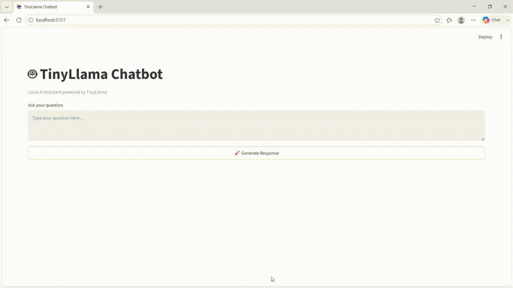

# 🦙 Local TinyLlama Chatbot

> A lightweight, fully offline AI chatbot powered by **TinyLlama 1.1B** — runs entirely on your machine with no API keys, no internet after setup, and complete privacy.


> 🎓 My first LLM project — built to understand local model inference, LangChain pipelines, and Streamlit-based chat interfaces end to end.

---

## 🎬 Demo

<!-- After uploading your GIF to the repo, replace the line below with the correct path -->
<!-- Example:  -->
<!-- If you used a GitHub Issue to host it, paste the URL directly below -->




---

## 📸 Screenshot


---

## ✨ Features

- 💻 Runs **100% locally** after one-time model download
- 🦙 Powered by **TinyLlama-1.1B-Chat** from Hugging Face
- 🔗 Built with **LangChain** for prompt and chain management
- 🖥️ Clean, minimal chat UI using **Streamlit**
- 🔒 Complete privacy — your data never leaves your machine
- ⚡ Lightweight — works even on machines without a GPU

---

## 🛠️ Tech Stack

| Component | Technology |
|---|---|
| LLM | [TinyLlama-1.1B-Chat-v1.0](https://huggingface.co/TinyLlama/TinyLlama-1.1B-Chat-v1.0) |
| Model Source | Hugging Face Hub |
| LLM Framework | LangChain |
| Model Loading | Hugging Face Transformers |
| UI | Streamlit |
| Language | Python |

---

## 🚀 Getting Started

### Prerequisites

- Python 3.8+
- ~600MB free disk space (for the TinyLlama model)

### Installation

```bash
# 1. Clone the repository
git clone https://github.com/AtharvaVSawant/local-tinyllama-chatbot.git
cd local-tinyllama-chatbot

# 2. Install dependencies
pip install -r requirements.txt

# 3. Run the app
streamlit run app.py
```

> **Note:** On the first run, the TinyLlama model (~600MB) will be automatically downloaded from Hugging Face and cached locally. After that, the app runs fully offline.

---

## 💬 Usage

1. Launch the app with `streamlit run app.py`
2. Wait for the model to load (first run may take a minute)
3. Type any message in the chat input
4. Get responses from TinyLlama — all on your machine!

---

## 📁 Project Structure

```
local-tinyllama-chatbot/
│
├── app.py               # Streamlit app + LangChain pipeline
├── requirements.txt     # Python dependencies
├── Chatbot.png          # Screenshot
└── README.md
```

---

## ⚙️ How It Works

The app uses LangChain's HuggingFace integration to wrap the TinyLlama model in a pipeline:

```python
from langchain_community.llms import HuggingFacePipeline
from transformers import pipeline

pipe = pipeline(
    "text-generation",
    model="TinyLlama/TinyLlama-1.1B-Chat-v1.0",
    torch_dtype="auto",
    device_map="auto",
    max_new_tokens=256
)

llm = HuggingFacePipeline(pipeline=pipe)
```

Streamlit handles the chat interface and session state to maintain conversation history.

---

## ⚠️ Known Limitations

- **Response quality** is lower than large cloud models (GPT-4, Claude) — this is expected. TinyLlama has **1.1B parameters** vs. GPT-4's estimated 1T+.
- May produce repetitive or off-topic responses on complex queries.
- Best suited for simple conversational tasks and short-context questions.

These are known tradeoffs of running a tiny model locally. The goal of this project was learning the **end-to-end local LLM pipeline**, not matching cloud performance.

---

## 📋 Requirements

```
transformers
torch
accelerate
langchain
langchain-community
streamlit
```

---

## 📬 Contact

**Atharva Sawant**
📧 [atharvasawant3183@gmail.com](mailto:atharvasawant3183@gmail.com)
🔗 [GitHub Profile](https://github.com/AtharvaVSawant)

---

## 📄 License

This project is licensed under the [MIT License](LICENSE).
