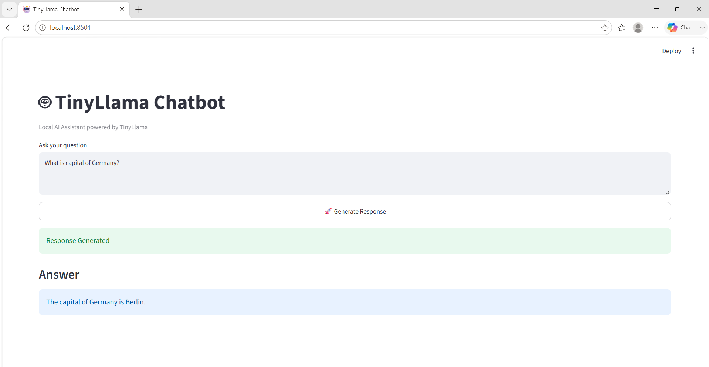

# 🦙 Local TinyLlama Chatbot

A lightweight, fully offline AI chatbot powered by **TinyLlama** running locally on your machine — no internet required after model download, no API keys, complete privacy.

> 🎓 This is my first LLM project — built to understand local model inference, LangChain pipelines, and Streamlit-based chat interfaces end to end.

---

## 📸 Screenshots

> _Chat Interface_



---

## 🚀 Features

- 💻 Runs **100% locally** after model download
- 🦙 Powered by **TinyLlama 1.1B** from Hugging Face
- 🔗 Built with **LangChain** for prompt/chain management
- 🖥️ Clean chat UI using **Streamlit**
- 🔒 Complete privacy — your data never leaves your machine
- 🤗 Uses **Hugging Face Transformers** for model loading

---

## 🛠️ Tech Stack

| Component | Technology |
|-----------|------------|
| LLM | [TinyLlama-1.1B-Chat](https://huggingface.co/TinyLlama/TinyLlama-1.1B-Chat-v1.0) |
| Model Source | Hugging Face Hub |
| Framework | LangChain |
| Model Loading | Hugging Face Transformers |
| Interface | Streamlit |
| Language | Python |

---

## 📦 Installation

### Prerequisites

- Python 3.8+

### Steps

```bash
# 1. Clone the repository
git clone https://github.com/AtharvaVSawant/local-tinyllama-chatbot.git
cd local-tinyllama-chatbot

# 2. Install dependencies
pip install -r requirements.txt

# 3. Run the chatbot (model will be auto-downloaded from Hugging Face on first run)
streamlit run app.py
```

> **Note:** On the first run, the TinyLlama model (~600MB) will be automatically downloaded from Hugging Face and cached locally. After that, it runs fully offline.

---

## 💬 Usage

1. Launch the app using the command above
2. Wait for the model to load (first run may take a moment to download)
3. Type your message in the chat input
4. Get instant responses from TinyLlama — all locally!

---

## 📁 Project Structure

```
local-tinyllama-chatbot/
├── app.py               # Streamlit app entry point
├── requirements.txt     # Python dependencies
├── screenshots/         # UI screenshots
│   ├── screenshot1.png
│   └── screenshot2.png
└── README.md
```

---

## ⚙️ Configuration

Model and chain are set up using LangChain's HuggingFace integration:

```python
from langchain_community.llms import HuggingFacePipeline
from transformers import pipeline

pipe = pipeline(
    "text-generation",
    model="TinyLlama/TinyLlama-1.1B-Chat-v1.0",
    torch_dtype="auto",
    device_map="auto",
    max_new_tokens=256
)

llm = HuggingFacePipeline(pipeline=pipe)
```

---

## ⚠️ Limitations

- **Response quality** is noticeably lower than large cloud-based models like ChatGPT — this is expected, since TinyLlama has only **1.1 billion parameters** compared to GPT-4's estimated 1 trillion+
- The model may occasionally produce repetitive or off-topic responses on complex queries
- Best suited for simple conversational tasks and short-context questions

These are known tradeoffs of running a tiny model locally, and the primary goal of this project was learning the **end-to-end pipeline** — not matching cloud model performance.

---

## 📋 Requirements

```
transformers
torch
accelerate
langchain
langchain-community
streamlit
```

---

## 🤝 Contributing

Pull requests are welcome! For major changes, please open an issue first to discuss what you'd like to change.

---

## 📄 License

[MIT](LICENSE)

---

## 👤 Author

**Atharva Sawant**  
GitHub: [@AtharvaVSawant](https://github.com/AtharvaVSawant)
